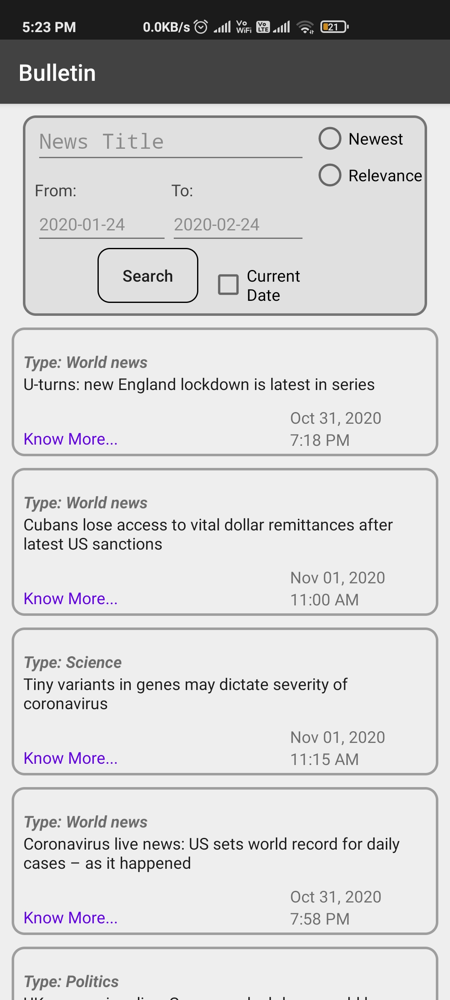
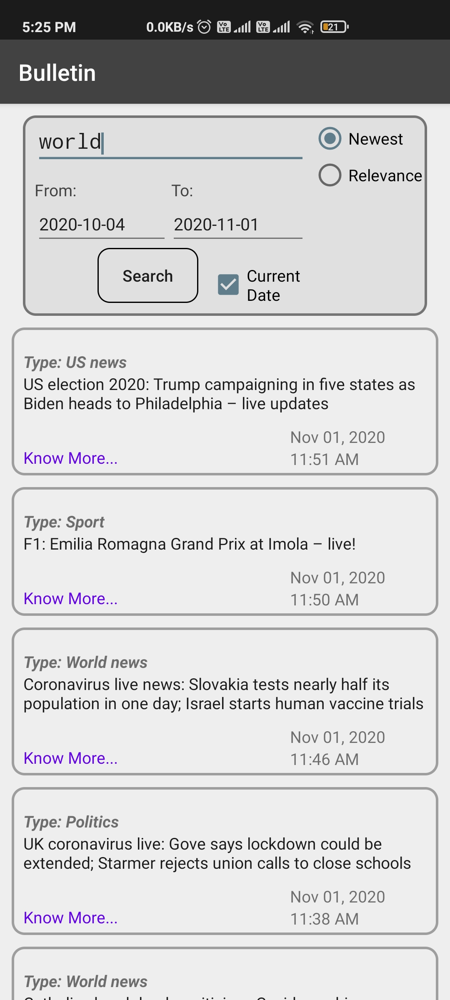
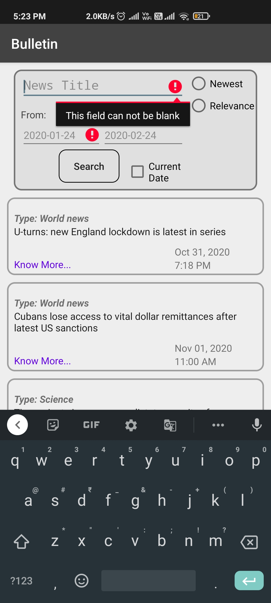
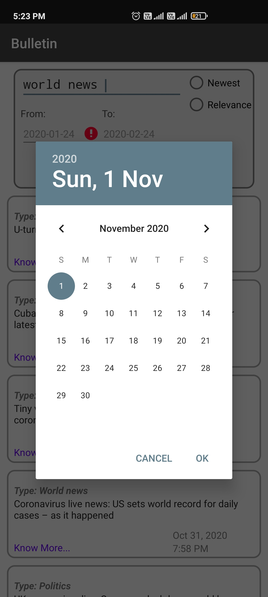
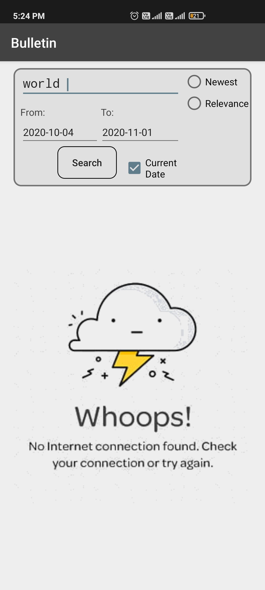
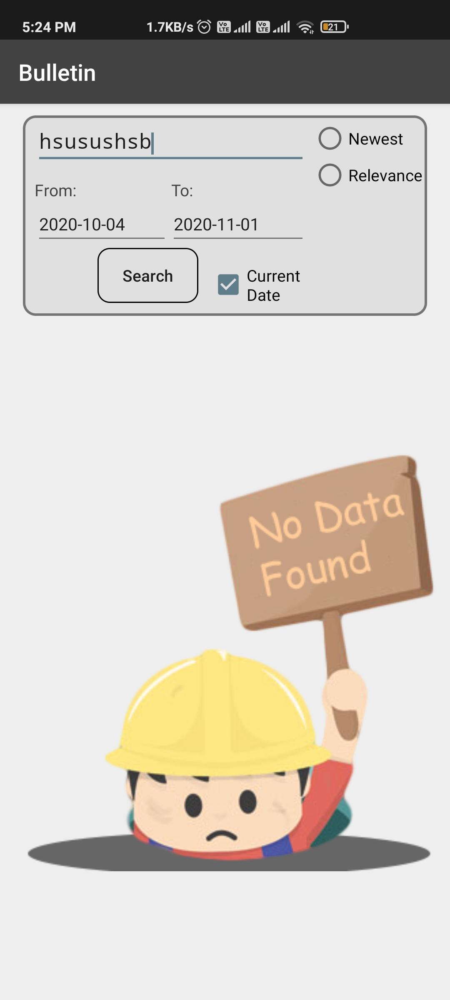

## Bulletin
  Bulletin brings you the latest  Wolrd Wide news on a search, According to you from the Newest news to Your search Revelant news, Keeping you up-to-date with all the latest news.
## Running the App
  The only way to run this app is to downlod and run Bulletin.apk
 
 
 # How the App Looks
 ## Main Dashboard
    
 
 When you enter in the app your show with the most revelant news of the day. But you can enter the the news you want to search and fillter the dates for them and How'd you like app to present you your news which are: Most Recent ones or Relevnat.
 
 
 
 ## Validations 
     
 
 You will need to Enter the from and to date in order to search for the news you want, And by default To Date is the current System date. And if you fail to do so App will show Errors in Red and Notify you.
 
 
 ## Data Reterving 
   
 
Theres Always a chances of Connection lost while Retriving data and or the news you searched "keywords" dont match any at that Case app will show Apporpritate Message Informing About the current Sitiuation of the App.

## INFO
App is using Rest API and JAVA Time API to show the user what they want at realtime. Every Day the Home DashBoard news will change according to the most recent affairs in the world. 
